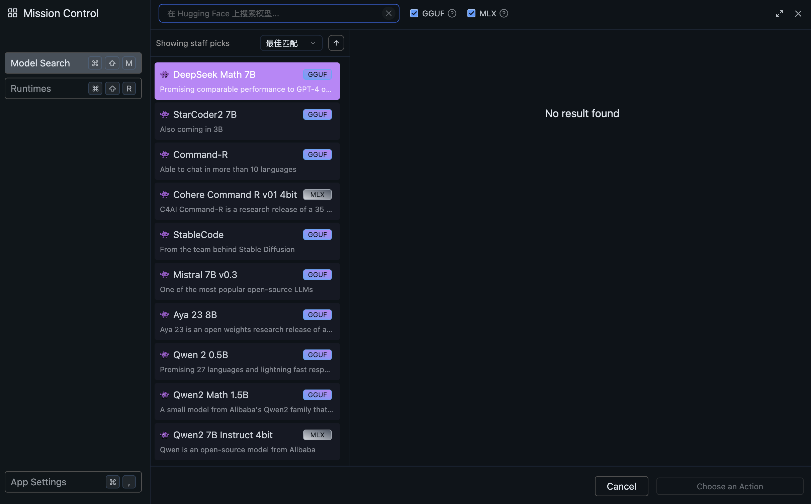
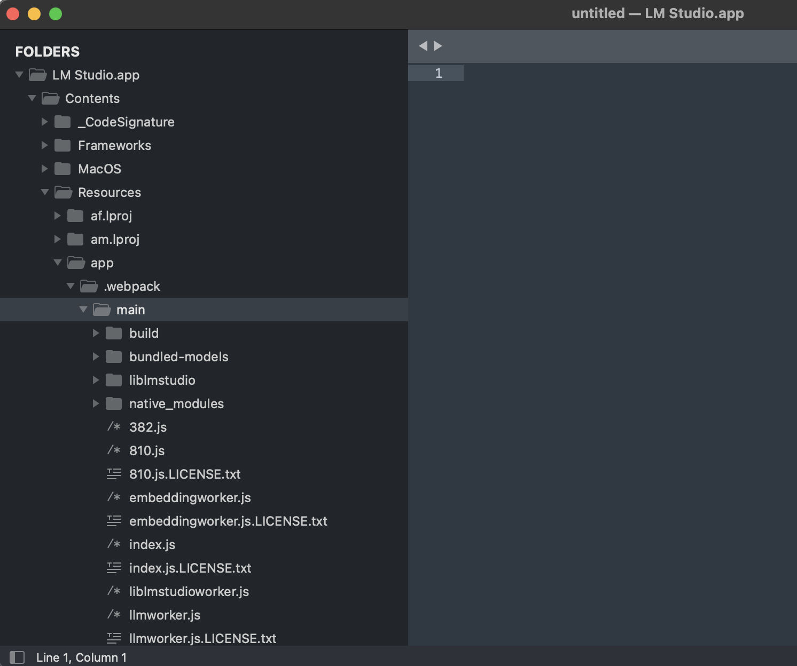
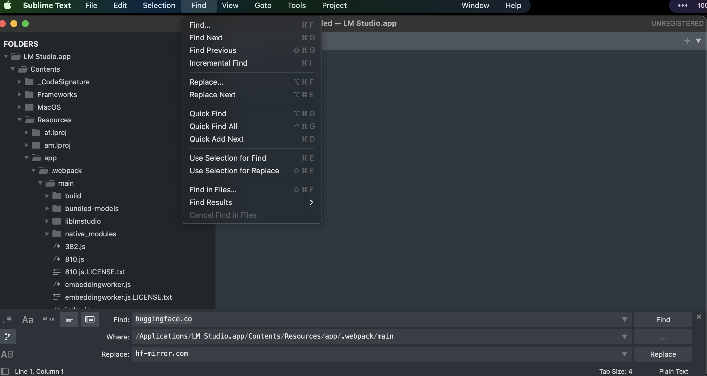
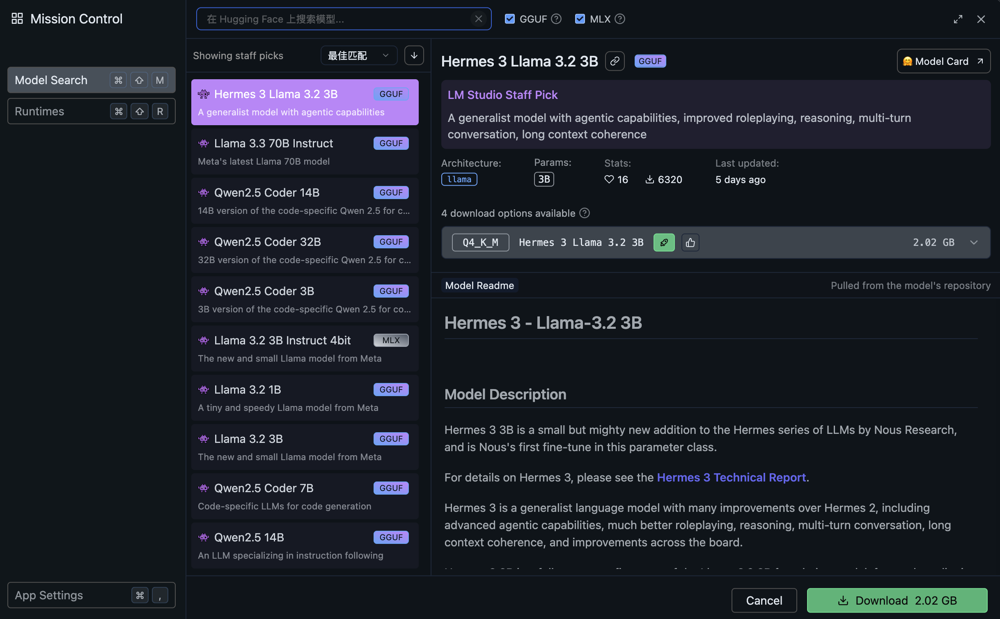

## 一、背景

- 时间：2024.12.12
- 芯片：Apple M3
- MacOS：Sequoia 15.1
- LM Studio版本：0.3.5

## 二、问题

MacBook安装LM Studio之后，模型搜索不到，如下图：

## 三、解决方法

看了很多网上的说明，大概率是梯子的关系，但是我已经全局梯子了，不知道为什么还是不能。

之后只能更换源了。步骤如下：

### 3.1 思路

把文件内的`huggingface.co` 替换成` hf-mirror.com`。但Mac系统和Windows系统的文件逻辑不一样，修改起来比较麻烦。

### 3.2 详细操作

#### 3.2.1 获取路径

最终的位置为

> LM Studio.app/Contents/Resources/app/.webpack/main

#### 3.2.2 替换内容

用sublime打开资料夹

之后替换内容，方式如下：

先在上面标签页的`Find > Find in Files`

然后下面按照图中填写，之后Replace，并且重开LM Studio即可

### 3.3 验证结果

再次开启LM Studio

发现已经出现原本没有的内容了！

Done！

## 参考内容

[^1]: https://mp.weixin.qq.com/s/WctJJx6unpefTRIkO3uEqQ

